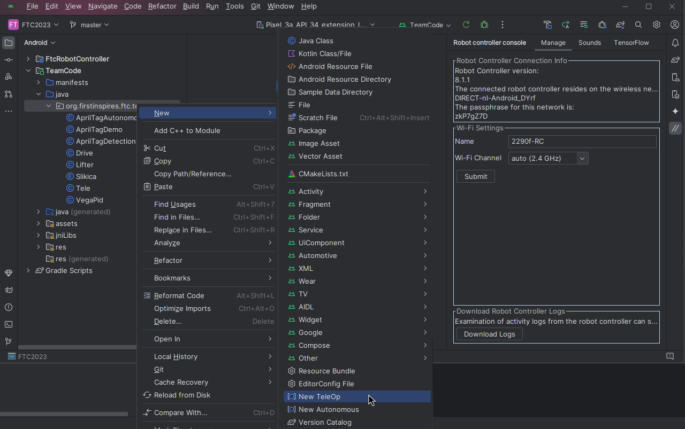

  

<h3 align="center"> A custom FTC code uploader Gradle plugin</h3>
 

[![Contributors][contributors-shield]][contributors-url]
[![Forks][forks-shield]][forks-url]
[![Stargazers][stars-shield]][stars-url]
[![Issues][issues-shield]][issues-url]
[![MIT License][license-shield]][license-url]

## 📄 Docs
Refer to the [Wiki Section][wiki-url].

## 📦 Installation

## ⚡ Usage

## 📜 License
This software is licensed under the [GPL-3.0 license][license-url]

###### Made with ❤️ by [VegaMind #22903](https://github.com/vegamind)

[contributors-shield]: https://img.shields.io/github/contributors/vegamind/ftcuploader.svg?style=for-the-badge
[forks-shield]: https://img.shields.io/github/forks/vegamind/ftcuploader.svg?style=for-the-badge
[stars-shield]: https://img.shields.io/github/stars/vegamind/ftcuploader.svg?style=for-the-badge
[issues-shield]: https://img.shields.io/github/issues/vegamind/ftcuploader.svg?style=for-the-badge
[license-shield]: https://img.shields.io/github/license/vegamind/ftcuploader.svg?style=for-the-badge

[contributors-url]: https://github.com/vegamind/ftcuploader/graphs/contributors
[forks-url]: https://github.com/vegamind/ftcuploader/network/members
[stars-url]: https://github.com/vegamind/ftcuploader/stargazers
[issues-url]: https://github.com/vegamind/ftcuploader/issues
[license-url]: https://github.com/vegamind/ftcuploader/blob/master/LICENSE
[wiki-url]: https://github.com/vegamind/ftcuploader/wiki
[releases-url]: https://github.com/vegamind/ftcuploader/releases
[discussions-url]: https://github.com/vegamind/ftcuploader/discussions